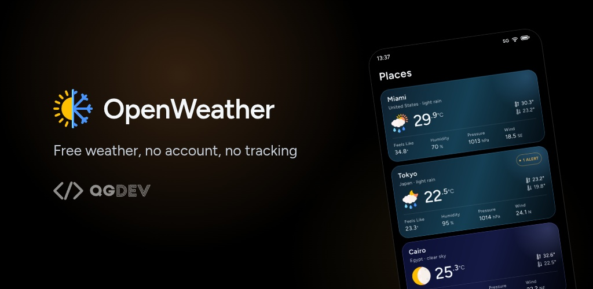

# OpenWeather
Android weather application based on OpenWeatherMap APIs.

[](LICENSE)


## Description
OpenWeather is an open-source weather application that clearly and simply displays the weather for a
multitude of cities.
The app is under the GPLv3 licence, please respect the terms of this licence.

The application is committed to not collecting any user data, only city data is sent to
OpenWeatherMap.

Since 0.10.0 the whole interface has been rewritten in Jetpack Compose, each city now having the
colour of its own sky.

## ✨ Features
* Every city under its own sky, by day and by night.
* Rain minute by minute for the next hour.
* Hourly forecasts for 48 hours and daily forecasts for 8 days.
* Air quality, with its six pollutants and an explanation of the index.
* Official weather alerts, in the words of the agency that issues them.
* Feels-like temperature, wind, humidity, pressure, visibility, UV index, sun and moon.
* Home screen widgets in three sizes.
* Your units and your language.

## 🔒 Privacy
Privacy is a fundamental right, that's why we only take the bare minimum and we prove it by making
the application open-source.

Only the necessary data are used by the application, these data are:
* OpenWeatherMap API key, only used to retrieve data from registered cities by the user.
* Registered cities, only used to know for which city the application need to search and display
  data.

The API key is stored encrypted and the registered cities never leave the phone, only the weather
requests do. City searching goes through OpenStreetMap Nominatim.

Everything is detailed in the [privacy policy](PRIVACY.md).

## 🔑 Getting started
The application needs your own OpenWeatherMap API key, you can create it on
[openweathermap.org](https://openweathermap.org/api). The application will ask for it on its first
run.

Forecasts come from the One Call API, you can choose its version in the settings:
* **3.0**, for keys subscribed to the "One Call by Call" plan. It is free up to 1,000 calls a day,
  but OpenWeatherMap asks for a bank card: set a limit of 1,000 calls a day in your account and you
  will never be charged.
* **2.5**, the former version, closed to keys created from June 2024. Some older keys still work
  with it.

Android 11 or newer is required.

## 📲 Availability on apps markets
#### Google Play Store
For now it is only available on the PlayStore as a closed alpha, there is the possibility to add
people on request.
But I will release it on public soon on the PlayStore.

#### F-Droid
For now it is not available on F-Droid but I am thinking to put my app on it.

## 🛠️ Building
```bash
./gradlew assembleDebug        # Debug APK
./gradlew assembleRelease      # Release APK
./gradlew test                 # Unit tests
```

## 🤝 Contributing
Issues and merge requests are welcome, please:
* write new code in Kotlin;
* put the GPLv3 header on every new file;
* check that `./gradlew test` passes;
* keep one subject per merge request.

## 📈 Version history
* **0.7**, February 2021: the first releases, then the French translation.
* **0.8**, 2021: weather alerts, a faster list and vector icons.
* **0.9**, 2021 – 2023: units settings, air quality, the GPLv3 licence, Material You colours and
  places reorderable by hand.
* **0.10**, 2025 – 2026: the application rebuilt, in Kotlin and Jetpack Compose, with a screen for
  each place, new widgets and a first run onboarding.

## ⚠️ Disclaimer
This application is powered by the OpenWeatherMap APIs but has no connection or affiliation with
OpenWeather Ltd.

## 🤖 Use of AI
Since 0.10, AI helped me to develop the application:
* The application already existed and worked, with its architecture and its data layer (Kotlin,
  Protobuf DataStore), all of it mine.
* AI took charge of the end of the migration of the views to Kotlin and of the new interface, under
  my direction, because I am not a UI/UX designer.
* I set the goals, I approved every plan and I checked the result.
* I used the application every day on my phone before releasing it.

The application itself doesn't use any AI.

## ⚖️ Credits

### Weather data and Forecasts
Weather data provided by [OpenWeather](https://openweathermap.org/), they are licensed under ODbL.
### API OpenWeatherMap
Use of [openweathermap.org](https://openweathermap.org/) APIs is licensed under CC BY-SA 4.0.
### Place searching
Place searching is done through [OpenStreetMap Nominatim](https://nominatim.openstreetmap.org/),
© [OpenStreetMap contributors](https://www.openstreetmap.org/copyright), licensed under ODbL.
### Icons
Icons made by [freepik.com](https://freepik.com) from [flaticon.com](https://flaticon.com).
### Typefaces
[Figtree](https://fonts.google.com/specimen/Figtree) and
[IBM Plex Mono](https://fonts.google.com/specimen/IBM+Plex+Mono), both under the SIL Open Font
License.
### Libraries
The open source libraries built into the application and their licences are listed in
[third_party.txt](app/src/main/assets/licenses/third_party.txt), and in the About section of the
application.
